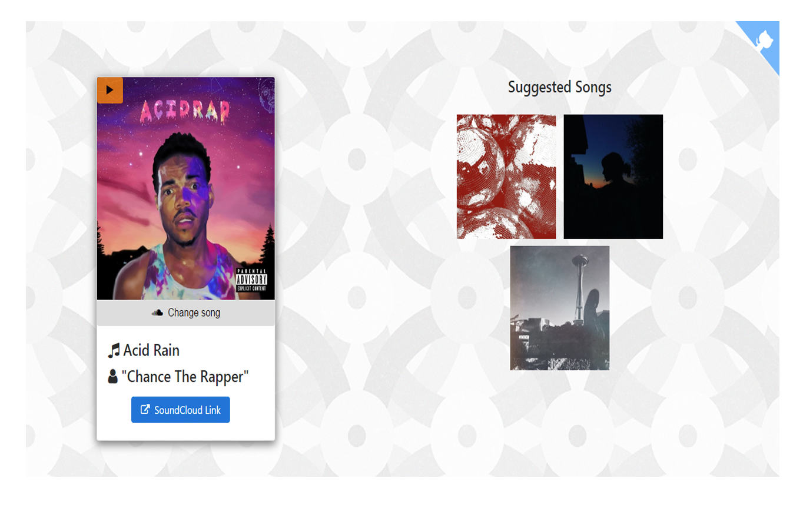

# SoundCloud Web Player ([check it out](https://shahzeb1.github.io/soundcloud-player/))

A proof of concept SoundCloud player which uses public API's (no developer account) to play music in the browser.

### Powered entirely by public API's (no SoundCloud auth token required).

**Running Example**: [shahzeb1.github.io/soundcloud-player](https://shahzeb1.github.io/soundcloud-player/)

Take a look in [SC.js](https://github.com/shahzeb1/soundcloud-player/blob/master/mySC.js) for the true magic.
